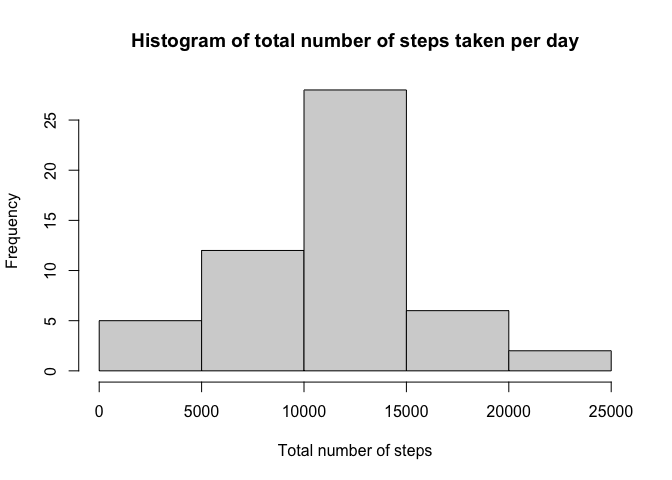
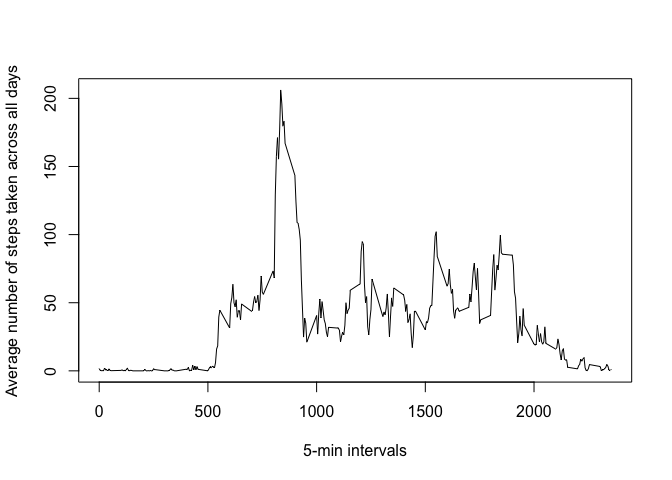
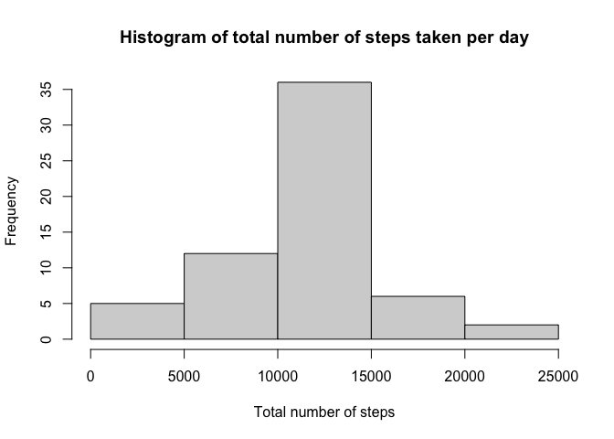
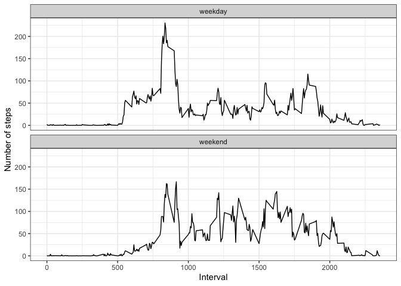

## Loading and preprocessing the data

This code loads and preprocesses the dataset.


```r
unzip("activity.zip") # unzip the file
activity <- read.csv("activity.csv") # loading data
activity$date <- as.Date(activity$date) # convert date (YYYY-MM-DD) to date format
#z <- as.POSIXlt(activity$date); z
#str(activity) # 17,568 observations and 3 variables
```

## What is mean total number of steps taken per day?

1. Calculate the total number of steps taken per day.


```r
#install.packages("pander") 
library(ggplot2); library(pander); panderOptions('digits', 2) # to format numbers for inline knitr
options(warn=-1) # turning off warning messages globally; use options(warn=0) to turn back on
total <- tapply(activity$steps, activity$date, sum) # calculate total number of steps per day
total.df <- as.data.frame.table(total) # convert array to dataframe
colnames(total.df) <- c("day", "total")
```

2. Make a histogram of the total number of steps taken each day.


```r
# A histogram of the total number of steps taken each day
hist(total.df$total, main="Histogram of total number of steps taken per day",
     xlab="Total number of steps")
```

<!-- -->

3. Calculate and report the mean and median of the total number of steps taken per day.


```r
t_mean <- round(mean(total.df$total, na.rm = TRUE))
t_median <- median(total.df$total, na.rm = TRUE)
```

Mean total number of steps taken per day is equal to _10766_.
Median total number of steps taken per day is equal to _10765_.


## What is the average daily activity pattern?

1. Make a time series plot (i.e. type = "l") of the 5-minute interval (x-axis) and the average number of steps taken, averaged across all days (y-axis)


```r
# The average number of steps taken across all days
steps_per_interval <- aggregate(steps ~ interval, activity, mean, na.rm = TRUE)
plot(steps ~ interval, data = steps_per_interval, type = "l",
     xlab = "5-min intervals", ylab = "Average number of steps taken across all days")
```

<!-- -->

2. Which 5-minute interval, on average across all the days in the dataset, contains the maximum number of steps?


```r
# Which 5-minute interval, on average across all the days, contains the maximum number of steps?
max_5_min_interval <- max(steps_per_interval$steps, na.rm = TRUE)
interval_id <- steps_per_interval[steps_per_interval$steps == max_5_min_interval, ][[1]]
```

The 5-minute interval that on average across all the days contains the maximum number of steps is _835_.


## Imputing missing values

Note that there are a number of days/intervals where there are missing values (coded as NA). The presence of missing days may introduce bias into some calculations or summaries of the data.

1. Calculate and report the total number of missing values in the dataset (i.e. the total number of rows with NAs).


```r
totalNAs <- sum(is.na(activity))
```

There are _2304_ of missing values in the dataset.

2. Devise a strategy for filling in all of the missing values in the dataset. The strategy does not need to be sophisticated. For example, you could use the mean/median for that day, or the mean for that 5-minute interval, etc.

Let's use the mean for the 5-minute interval to fill the missing values.

3. Create a new dataset that is equal to the original dataset but with the missing data filled in.


```r
library(dplyr)
```

```
## 
## Attaching package: 'dplyr'
```

```
## The following objects are masked from 'package:stats':
## 
##     filter, lag
```

```
## The following objects are masked from 'package:base':
## 
##     intersect, setdiff, setequal, union
```

```r
imputed <- activity %>% 
    mutate(steps = case_when(
        is.na(steps) ~ steps_per_interval$steps[match(activity$interval,
                                                      steps_per_interval$interval)], 
        TRUE ~ as.numeric(steps)))
```

4. Make a histogram of the total number of steps taken each day and Calculate and report the mean and median total number of steps taken per day. Do these values differ from the estimates from the first part of the assignment? What is the impact of imputing missing data on the estimates of the total daily number of steps?


```r
total_noNAs <- imputed %>% group_by(date) %>% summarise(new_steps = sum(steps))

# A histogram of the total number of steps taken each day
hist(total_noNAs$new_steps, main="Histogram of total number of steps taken per day",
     xlab="Total number of steps")
```

<!-- -->

```r
imputed_t_mean <- mean(total_noNAs$new_steps)
imputed_t_median <- median(total_noNAs$new_steps)
```

The mean of total number of steps taken per day is equal to _10766_. 
The meadian of total number of steps taken per day is equal to _10766_. 


## Are there differences in activity patterns between weekdays and weekends?

1. Create a new factor variable in the dataset with two levels – “weekday” and “weekend” indicating whether a given date is a weekday or weekend day.


```r
library(lubridate)
```

```
## 
## Attaching package: 'lubridate'
```

```
## The following objects are masked from 'package:base':
## 
##     date, intersect, setdiff, union
```

```r
day.df <- imputed %>% mutate(date = ymd(date),
                          day_type = case_when(wday(date) %in% 2:6 ~ "weekday",
                                                         wday(date) %in% c(1,7) ~ "weekend"))
```

2. Make a panel plot containing a time series plot (i.e. type = "l") of the 5-minute interval (x-axis) and the average number of steps taken, averaged across all weekday days or weekend days (y-axis). See the README file in the GitHub repository to see an example of what this plot should look like using simulated data.


```r
library(ggplot2)
new.df <- group_by(day.df, interval, day_type) %>% summarise(mean_steps = mean(steps))
```

```
## `summarise()` has grouped output by 'interval'. You can override using the `.groups` argument.
```

```r
ggplot(new.df, aes(interval, mean_steps)) + geom_line() + 
    facet_wrap(~ day_type, nrow = 2) +
    xlab("Interval") + ylab ("Number of steps") +
    theme_bw()
```

<!-- -->

